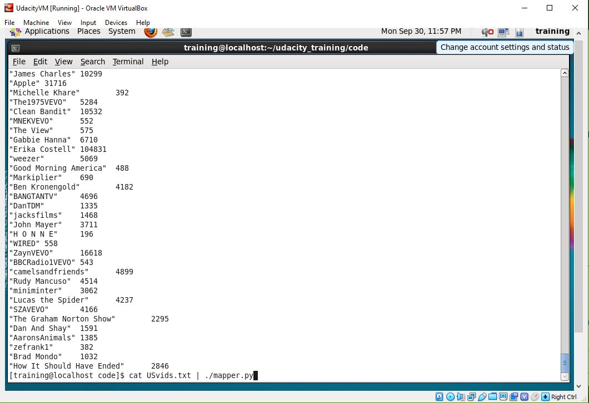
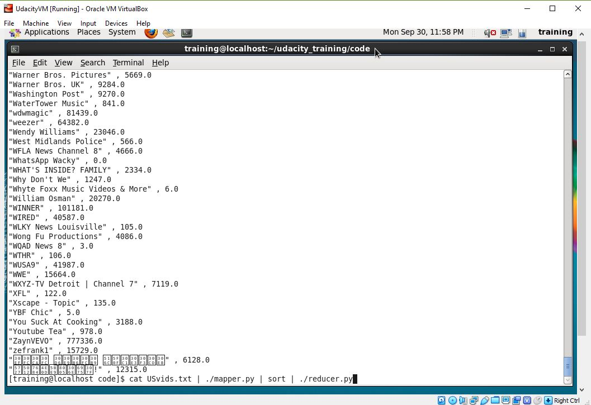

# Youtube Trends
#### Big Data 44517, Section 1
#### Pair 1: Chase Smith, Kevin Hart
#### Pair 2: Jacob Taylor, Kaleb Odle

## Links
Viewable : https://cweltonsmith.github.io/big-data-youtube-trends/

## Introduction
#### Youtube is the most widely known and popular video sharing service on the internet. This means there is a plethora of data available to pull from it. This project will deal with finding various "big data elements" (such as count or maximum) from Excel sheet(s) of pulled Youtube data.

## Data Source
#### The data source is multiple excel documents that each provide youtube data for a specific country. We will be using the USvideos.csv file as our specific source. The format is structed and the time range is from November 2017 to May 2018. The USvideos.csv file itself is 61 mb.

#### https://www.kaggle.com/datasnaek/youtube-new

## The Challenge

#### Volume: There are over 40,000 rows with 16 columns for each row making a total of ~640,000 records.

#### Variety: The data is in a structued excel spreadsheet. Since the data is gathered from youtube, the only think that might be different is the video itself and the rest is constrained.

#### Velocity: The data is at rest. Trending videos change everyday depending on what is trending right now.

#### Veracity: The data is clean and was gathered from the YouTube API so the statictics will be very trustworthy.

#### Value: Video statistics on trending videos are useful for people who make other content to see what is popular. Its also impornant for people who make money off of the trending content and for the advertisers to see what categories people watch the most.

## Big Data Questions
#### Kevin: For each channel with trending videos in the US find the total number of views.
#### Chase: For each channel with trending videos in the US find the total number of dislikes.
#### Jacob: For each channel with trending videos in the US find the total number of likes.
#### Kaleb: For each channel with trending videos in the US find the max number of comments.

## Big Data Solutions
  #### Mapper Input:
    
    Kevin Hart:
    2kyS6SvSYSE	17.14.11	WE WANT TO TALK ABOUT OUR MARRIAGE	CaseyNeistat	22	2017-11-13T17:13:01.000Z	SHANtell martin	748374	57527	2966	15954	https://i.ytimg.com/vi/2kyS6SvSYSE/default.jpg	FALSE	FALSE	FALSE	SHANTELL'S CHANNEL - https://www.youtube.com/shantellmartin\nCANDICE - https://www.lovebilly.com\n\nfilmed this video in 4k on this -- http://amzn.to/2sTDnRZ\nwith this lens -- http://amzn.to/2rUJOmD\nbig drone - http://tinyurl.com/h4ft3oy\nOTHER GEAR ---  http://amzn.to/2o3GLX5\nSony CAMERA http://amzn.to/2nOBmnv\nOLD CAMERA; http://amzn.to/2o2cQBT\nMAIN LENS; http://amzn.to/2od5gBJ\nBIG SONY CAMERA; http://amzn.to/2nrdJRO\nBIG Canon CAMERA; http://tinyurl.com/jn4q4vz\nBENDY TRIPOD THING; http://tinyurl.com/gw3ylz2\nYOU NEED THIS FOR THE BENDY TRIPOD; http://tinyurl.com/j8mzzua\nWIDE LENS; http://tinyurl.com/jkfcm8t\nMORE EXPENSIVE WIDE LENS; http://tinyurl.com/zrdgtou\nSMALL CAMERA; http://tinyurl.com/hrrzhor\nMICROPHONE; http://tinyurl.com/zefm4jy\nOTHER MICROPHONE; http://tinyurl.com/jxgpj86\nOLD DRONE (cheaper but still great);http://tinyurl.com/zcfmnmd\n\nfollow me; on http://instagram.com/caseyneistat\non https://www.facebook.com/cneistat\non https://twitter.com/CaseyNeistat\n\namazing intro song by https://soundcloud.com/discoteeth\n\nad disclosure.  THIS IS NOT AN AD.  not selling or promoting anything.  but samsung did produce the Shantell Video as a 'GALAXY PROJECT' which is an initiative that enables creators like Shantell and me to make projects we might otherwise not have the opportunity to make.  hope that's clear.  if not ask in the comments and i'll answer any specifics
    
    Chase Smith:
    1ZAPwfrtAFY	17.14.11	The Trump Presidency: Last Week Tonight with John Oliver (HBO)	LastWeekTonight	24	2017-11-13T07:30:00.000Z	last week tonight trump presidency|"last week tonight donald trump"|"john oliver trump"|"donald trump"	2418783	97185	6146	12703	https://i.ytimg.com/vi/1ZAPwfrtAFY/default.jpg	FALSE	FALSE	FALSE	One year after the presidential election, John Oliver discusses what we've learned so far and enlists our catheter cowboy to teach Donald Trump what he hasn't.\n\nConnect with Last Week Tonight online...\n\nSubscribe to the Last Week Tonight YouTube channel for more almost news as it almost happens: www.youtube.com/user/LastWeekTonight\n\nFind Last Week Tonight on Facebook like your mom would: http://Facebook.com/LastWeekTonight\n\nFollow us on Twitter for news about jokes and jokes about news: http://Twitter.com/LastWeekTonight\n\nVisit our official site for all that other stuff at once: http://www.hbo.com/lastweektonight
    
    Kaleb Odle:
    XpVt6Z1Gjjo 1 YEAR OF VLOGGING -- HOW LOGAN PAUL CHANGED YOUTUBE FOREVER! Logan Paul Vlogs  24  logan paul vlog|logan paul|logan|paul|olympics|logan paul youtube|vlog|daily|comedy|hollywood|parrot|maverick|bird|maverick clothes|diamond play button|logan paul diamond play button|10M subscribers|logan paul 1 year vlogging|1 year vlog|dwarf mamba play button|logan paul history|youtube history|10M|10M plaque|youtube button|diamond button|logang|logang 4 life  5854127 361422  22023 54671 https://i.ytimg.com/vi/XpVt6Z1Gjjo/default.jpg  15.09
    
    Jacob Taylor:
    d380meD0W0M	17.14.11	I Dare You: GOING BALD!?	nigahiga	24	2017-11-12T18:01:41.000Z	ryan|"higa"|"higatv"|"nigahiga"|"i dare you"|"idy"|"rhpc"|"dares"|"no truth"|"comments"|"comedy"|"funny"|"stupid"|"fail"	2095731	132235	1989	17518	https://i.ytimg.com/vi/d380meD0W0M/default.jpg	False	False	False	I know it's been a while since we did this show, but we're back with what might be the best episode yet!\nLeave your dares in the comment section! \n\nOrder my book how to write good \nhttp://higatv.c..

  #### Example Mapper Output/ Reducer Input:

    Kevin Hart:
    CaseyNeistat   748374.0
    
    Chase Smith:
    LastWeekTonight   6146.0
    
    Kaleb Odle:
    Logan Paul Vlogs  54671
    
    Jacob Taylor:
    nigahiga  132235.0

  #### Example Reducer Output:

    Kevin Hart:
    CaseyNeistat    232745266.0
    
    Chase Smith:
    LastWeekTonight   (31234.0)
    
    Kaleb Odle:
    Logan Paul Vlogs  54671
    (Note: due to mine not being a ongoing calculation, but rather replacing a value if it is larger, this output will not always remain unchanged from the reducer input. If a video from the same channel has less comments it will simply not show in the output)
    
    Jacob Taylor:
    nigahiga  132568453.0

  #### Language:

    Kevin Hart:
    I used Python for MapReduce.
    
    Chase Smith:
    I used Python for MapReduce.
    
    Kaleb Odle:
    I will be using Python for MapReduce.
    
    Jacob Taylor:
    I will be using Python for MapReduce
  #### Charts: 
  
    Kevin Hart:
    I made a barchart showing the difference between the top 5 and lowest 5. 
  
  
    
    Chase Smith:
    I made a pie chart for the top 10 disliked trending youtube channels. In order to get the data to excel I converted it to a .csv file and emailed it out of the VM. To get rid of the float value in excel I simply selected the column, choose Data/Text to Column, then select delimited. After that choose other and input .0 to change it from text to float to a whole number.

  
    
    Kaleb Odle:
    I will make a column chart showing the top 10 most commented videos and their corresponding channel.
    
    Jacob Taylor:
    I will make a bar chart that shows the that shows the difference in the amount of likes of the top 20 videos
  
  #### Output:

  Kevin Hart:

  Mapper:
  
  Reducer:
  

Kevin Hart:
    I made a barchart showing the difference between the top 5 and lowest 5. 
  
  
    
    Chase Smith:
    I made a pie chart for the top 10 disliked trending youtube channels. In order to get the data to excel I converted it to a .csv file and emailed it out of the VM. To get rid of the float value in excel I simply selected the column, choose Data/Text to Column, then select delimited. After that choose other and input .0 to change it from text to float to a whole number.

  
    
    Kaleb Odle:
    I will make a column chart showing the top 10 most commented videos and their corresponding channel.
    
    Jacob Taylor:
    I will make a bar chart that shows the that shows the difference in the amount of likes of the top 20 videos
  
  #### Output:

  Kevin Hart:

  Mapper:
  
  Reducer:
  

  Chase Smith:

  Mapper:
  
  Reducer:
  

  Kaleb Odle:

  Mapper:
  
  Reducer:
  
  
  #### Challenges:
  
  Kevin Hart:
  
  Chase Smith:
  
  Kaleb Odle:
  
  Jacob Taylor:
